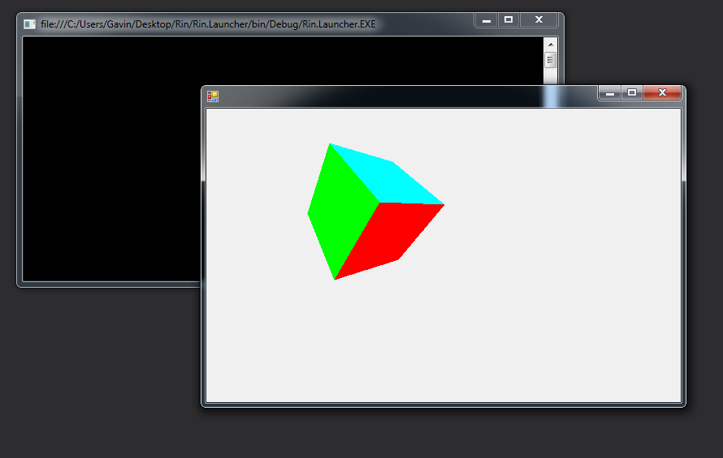

# Rin

Rin is a small and dynamic programming language that executes on the Common Language Runtime.
It offers a type system that is both dynamically and strongly typed. It can access .NET Framework libraries including Microsoft's proprietary .NET BCL.

# Syntax

	func avg(nums):
		sum = 0
		for num in nums:
			sum = sum + num
			
		return sum / nums.length
		
	nums = [1, 2, 3, 4, 5]
		
	avg(nums)

# Example

Drawing a 3D rotating cube

	class Point(x, y, z):
		func rotate_x(angle):
			var rad, cosa, sina, ny, nz
			rad = angle * maths.PI / 180
			cosa = maths.cos(rad)
			sina = maths.sin(rad)
			ny = y * cosa - z * sina
			nz = y * sina + z * cosa
			return Point(x, ny, nz)
	
		func rotate_y(angle):
			var rad, cosa, sina, nx, nz
			rad = angle * maths.PI / 180
			cosa = maths.cos(rad)
			sina = maths.sin(rad)
			nz = z * cosa - x * sina
			nx = z * sina + x * cosa
			return Point(nx, y, nz)
	
		func rotate_z(angle):
			var rad, cosa, sina, nx, ny
			rad = angle * maths.PI / 180
			cosa = maths.cos(rad)
			sina = maths.sin(rad)
			nx = x * cosa - y * sina
			ny = x * sina + y * cosa
			return Point(nx, ny, z)
	
		func project(width, height, fov, dist):
			var factor = fov / (dist + z)
			var nx = x * factor + width / 2
			var ny = y * factor + height / 2
	
			return Point(nx, ny, z)
	
	var vertices = [
		Point(-1, 1, -1),
		Point(1, 1, -1),
		Point(1, -1, -1),
		Point(-1, -1, -1),
		Point(-1, 1, 1),
		Point(1, 1, 1),
		Point(1, -1, 1),
		Point(-1, -1, 1)
	]
	
	var faces  = [[0,1,2,3],[1,5,6,2],[5,4,7,6],[4,0,3,7],[0,4,5,1],[3,2,6,7]]
	
	var colors = [[255,0,0],[0,255,0],[0,0,255],[255,255,0],[0,255,255],[255,0,255]]
	
	var angle = 0
	
	func loop():
		var t = []
		for v in vertices:
			var r = v.rotate_x(angle).rotate_y(angle)
			var p = r.project(400, 250, 200, 4)
			t.add(p)
	
		var avg_z = []
	
		class AvgZ(index, z):
			pass
		
		for i in range(0, faces.length):
			var f = faces[i]
			avg_z.add(AvgZ(i, (t[f[0]].z + t[f[1]].z + t[f[2]].z + t[f[3]].z) / 4.0))
	
		func sort_avg(a, b):
			return b.z - a.z
		avg_z.sort(sort_avg)
	
		for i in range(0, faces.length):
			var f = faces[avg_z[i].index]
			set_fill(colors[avg_z[i].index])
			poly(t[f[0]].x, t[f[0]].y, t[f[1]].x, t[f[1]].y, t[f[2]].x, t[f[2]].y, t[f[3]].x, t[f[3]].y)
	
		angle = angle + 0.05
	
	draw(loop)

